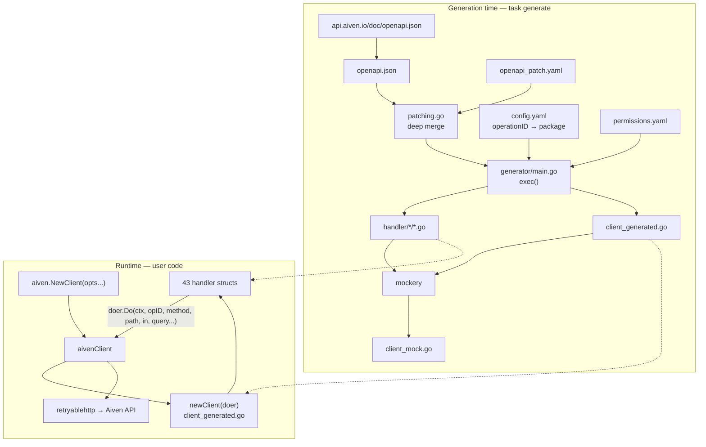

# Architecture — source code map

A map of what lives where in `go-client-codegen`, and how the pieces fit together.

The repository holds two distinct programs that never run at the same time:

1. **The generator** (`generator/`, build tag `generator`) — a developer tool that reads the Aiven OpenAPI
   specification and writes Go source into `handler/` and `client_generated.go`.
2. **The client** (repository root + `handler/`) — the library that users import. Its API surface is almost
   entirely generated; the hand-written part is only the transport, error, retry and option layer.

Roughly 18k of the ~20k lines of Go under version control are generated output, plus a ~1M-line generated mock.
Editing generated files by hand is pointless — they are deleted and rewritten on every `task generate`.

## Directory layout

| Path                  | Written by | What it is                                                            |
| --------------------- | ---------- | --------------------------------------------------------------------- |
| `client.go`           | hand       | `aivenClient`: config, HTTP transport, singleflight, query formatting  |
| `option.go`           | hand       | `Option` functional options (`TokenOpt`, `DoerOpt`, `RetryMaxOpt`, …)  |
| `error.go`            | hand       | `Error` type, `IsNotFound`/`IsAlreadyExists`, HTTP → error conversion  |
| `retry.go`            | hand       | Retry policy on top of `retryablehttp` (501/417/408/404 special cases) |
| `permissions.go`      | hand       | Embeds `permissions.yaml`, exposes `Permissions()`                     |
| `version.go`          | CI         | `Version()` — bumped by the release workflow                           |
| `client_generated.go` | generator  | `Client` interface + `client` struct embedding all 43 handlers         |
| `client_mock.go`      | mockery    | testify mock of `Client` (~1 MB, do not read, do not edit)             |
| `handler/<pkg>/`      | generator  | One package per API group: `Handler` interface, impl, request/response DTOs, enums |
| `generator/`          | hand       | The code generator itself                                              |
| `config.yaml`         | hand       | Operation ID → handler package assignment (the only place ops are enabled) |
| `openapi_patch.yaml`  | hand       | Deep-merge patch applied to the upstream spec before generation        |
| `permissions.yaml`    | hand + gen | Operation ID → required roles/permissions; pruned & re-sorted on generate |
| `Taskfile.yml`        | hand       | `task generate`, `task test`, import formatting                        |
| `.mockery.yaml`       | hand       | Mock generation config for the `Client` interface                      |

## The two programs

## Generator internals (`generator/`, build tag `generator`)

| File              | Responsibility                                                                                     |
| ----------------- | -------------------------------------------------------------------------------------------------- |
| `main.go`         | `exec()` — the whole pipeline: read config, patch spec, group paths by package, emit code via `jennifer`. Also `writeStruct`, `fmtStruct`, `fmtQueryParam`, `customCamelCase`. |
| `models.go`       | The OpenAPI object model (`Doc`, `Path`, `Parameter`, `Schema`) and `Schema.init` — naming, collision resolution, pointer/type mapping. |
| `patching.go`     | `readOpenAPIPatched` — recursive `patchDict` merge of the YAML patch into the JSON spec.            |
| `permissions.go`  | `readPermissions` — loads permissions, drops entries for operations not in `config.yaml`, rewrites the file sorted. |
| `config_check.go` | `checkDuplicateEndpoints` — fails generation if one operation ID is assigned to two packages.       |

Configuration is environment-driven (`GEN_` prefix, `envConfig` in `main.go`): `GEN_OUT_DIR`, `GEN_CONFIG_FILE`,
`GEN_OPENAPI_FILE`, `GEN_PERMISSIONS_FILE`, `GEN_CLIENT_FILE`, `GEN_MODULE`, `GEN_PACKAGE`.

### Pipeline in `exec()`

1. Read `config.yaml` (sorted and rewritten in place), reject duplicate operation IDs.
2. Read `permissions.yaml`, prune to operations that exist in the config.
3. Read `openapi.json` and deep-merge `openapi_patch.yaml` over it.
4. Walk `doc.Paths`; prefix unversioned paths with `/v1`; resolve `$ref` parameters against
   `components.parameters`. Operations absent from `config.yaml` are logged and skipped —
   **an operation not listed in `config.yaml` is not generated.** Config entries with no matching
   spec operation are a hard error.
5. Per package: sort operations by name, emit the `Handler` interface, the `doer` interface,
   `NewHandler`, the `<Pkg>Handler` struct, one method per operation, and every struct/enum
   collected in the package `scope`.
6. Emit `client_generated.go`: `newClient`, `client` struct, `Client` interface.

### `Schema.init` — where the naming rules live

The hard part of the generator is turning loosely-typed OpenAPI schemas into stable Go names.
`models.go:203` handles all of it:

- **In/Out separation** — request DTOs get the `In` suffix, response DTOs `Out`. Deliberately never shared
  (see `CONTRIBUTING.md`), so a change on one side cannot ripple into the other.
- **Collision resolution** — identical schemas are deduplicated by `hash()`; differing ones get the parent's
  name prefixed, then an `Alt` suffix as a last resort. A handful of unfixable cases are hardcoded (`MessageFormatVersionValueType` → `MessageFormatVersionType`, the Vpc peering state enums, schema-registry compatibility enums).
- **Pointers** — optional scalars become pointers so absent and zero-valued fields are distinguishable;
  array elements are forced `required` so slices never contain `nil`.
- **Enums** — become a named string/int type plus `const` block plus a `<Name>Choices()` function.
- **Time** — string fields whose name ends in `_at` or `_time` are mapped to `time.Time`.
- **Maps** — `additionalProperties`, and the Aiven-specific `{"properties": {"ANY": …}}` idiom, both become Go maps.
- **Unwrapping** — a response object with exactly one property is made private and the method returns the
  inner field directly (`ListClouds` returns `[]CloudOut`, not a wrapper struct).
- **Anonymous structs** — colliding objects nested deeper than 3 levels are inlined rather than named.

## Client internals (root package `aiven`)

### Request lifecycle

`YourHandler.SomeOperation(ctx, args…)` (`handler/<pkg>/<pkg>.go`)
→ builds `path` with `fmt.Sprintf` + `url.PathEscape`
→ `h.doer.Do(ctx, operationID, method, path, in, query...)`
→ `aivenClient.Do` (`client.go:124`): stores the operation ID in the context under `OperationIDKey{}`,
formats the query string, optionally deduplicates via singleflight, logs when `Debug`
→ `aivenClient.do` (`client.go:179`): marshals the body (skipped when empty), sets
`Content-Type`/`User-Agent`/`Authorization: aivenv1 <token>`, executes through the `Doer`
→ `fromBytes` (`error.go:58`): non-2xx becomes an `aiven.Error`, otherwise raw bytes
→ back in the handler: `json.Unmarshal` into the generated `…Out` type.

### Cross-cutting behaviours worth knowing

- **Single flight** (`client.go:157`) — concurrent identical safe-method requests (GET/HEAD/OPTIONS/TRACE)
  share one response. Key is `method|host|path|query`. Toggle with `AIVEN_CLIENT_ENABLE_SINGLE_FLIGHT`
  / `EnableSingleFlightOpt`.
- **Default `limit=999`** (`client.go:214`) — added to every request that does not already set `limit`,
  except `ServiceKafkaQuotaDescribe` and `ServiceKafkaQuotaDelete`. This is an explicit stopgap for the
  absence of real pagination support.
- **Retries** (`retry.go`) — `retryablehttp`'s policy plus Aiven-specific cases: 408 and 501 always retry,
  417 retries on `DELETE`, and 404 retries when the body matches `Service … does not exist` on `POST` or
  `User (avnadmin|root) with component main not found`. Defaults: 6 attempts, 2s–15s backoff.
- **Configuration** — every knob is both an env var and an `Option`; `envconfig` is processed first,
  options override it (`client.go:39`). A missing token is a hard failure.

### Configuration reference

| Env var                              | Option                  | Default                 |
| ------------------------------------ | ----------------------- | ----------------------- |
| `AIVEN_TOKEN`                        | `TokenOpt`              | — (required)            |
| `AIVEN_WEB_URL`                      | `HostOpt`               | `https://api.aiven.io`  |
| `AIVEN_USER_AGENT`                   | `UserAgentOpt`          | `aiven-go-client/v3`    |
| `AIVEN_DEBUG`                        | `DebugOpt`              | `false`                 |
| `AIVEN_CLIENT_RETRY_MAX`             | `RetryMaxOpt`           | `6`                     |
| `AIVEN_CLIENT_RETRY_WAIT_MIN`        | `RetryWaitMinOpt`       | `2s`                    |
| `AIVEN_CLIENT_RETRY_WAIT_MAX`        | `RetryWaitMaxOpt`       | `15s`                   |
| `AIVEN_CLIENT_ENABLE_SINGLE_FLIGHT`  | `EnableSingleFlightOpt` | `true`                  |
| —                                    | `DoerOpt`               | `retryablehttp` client  |

## Handler packages

43 packages, 395 operations. One file per package, named after the package. The `Client` interface embeds
all 43 `Handler` interfaces, so every operation is reachable directly from the client by its operation ID —
no handler navigation, and the name is stable across spec changes (see `CONTRIBUTING.md`, "Unified Interface
Concept").

Largest first, by operation count:

| Package                    | Ops | Package                       | Ops |
| -------------------------- | --: | ----------------------------- | --: |
| `service`                  |  44 | `byoc`                        |   7 |
| `user`                     |  27 | `organizationvpc`             |   7 |
| `project`                  |  26 | `usergroup`                   |   7 |
| `privatelink`              |  19 | `cmk`                         |   6 |
| `organization`             |  18 | `flinkapplicationdeployment`  |   6 |
| `account`                  |  16 | `flinkjarapplicationdeployment` | 6 |
| `kafkaschemaregistry`      |  16 | `organizationbilling`         |   6 |
| `billinggroup`             |  15 | `postgresql`                  |   6 |
| `kafka`                    |  14 | `upgradepipeline`             |   6 |
| `organizationuser`         |  12 | `accountauthentication`       |   5 |
| `clickhouse`               |  11 | `accountteammember`           |   5 |
| `kafkaconnect`             |  11 | `domain`                      |   5 |
| `accountteam`              |  10 | `flinkapplication`            |   5 |
| `vpc`                      |   9 | `flinkjarapplication`         |   5 |
| `applicationuser`          |   8 | `kafkamirrormaker`            |   5 |
| `kafkatopic`               |   8 | `organizationprojects`        |   5 |
| `opensearch`               |   8 | `projectbilling`              |   5 |
| `staticip`                 |   8 | `flinkapplicationversion`     |   4 |
| `organizationgovernance`   |   4 | `flinkjarapplicationversion`  |   3 |
| `cloud`                    |   2 | `flinkjob`                    |   2 |
| `flink`                    |   1 | `mysql`                       |   1 |
| `thanos`                   |   1 |                               |     |

Each generated file follows the same shape: `Handler` interface (doc comments carry the summary, the
`METHOD /path`, a link to the API docs, and required permissions) → private `doer` interface →
`NewHandler` → `<Pkg>Handler` struct → query-parameter helper functions returning `[2]string` →
methods → DTO structs → enum types with `Choices()`.

## Tests

| File                  | Covers                                                                        |
| --------------------- | ----------------------------------------------------------------------------- |
| `client_test.go`      | Construction, request/response round-trip, retry behaviour, `fmtQuery` default limit, singleflight (deduplication, HTTP-level, project isolation, method isolation) |
| `error_test.go`       | `IsNotFound`, `IsAlreadyExists`, `fromResponse` including non-JSON bodies      |
| `permissions_test.go` | The embedded `permissions.yaml` parses and resolves                            |

Handler packages have no tests of their own — they are generated, so the generator and the transport layer
are what get tested. Run with `task test` (`go test -race -count=1 -v ./...`).

## CI workflows

| Workflow             | Trigger                        | Purpose                                                                 |
| -------------------- | ------------------------------ | ----------------------------------------------------------------------- |
| `update.yml`         | weekdays 03:00 UTC + manual    | Fetch the latest spec, run `task generate`, open a PR; closes superseded update PRs |
| `test.yml`           | PR / push to `main`            | `task test`                                                             |
| `lint.yml`           | PR / push to `main`            | commitlint (Conventional Commits) + Trunk.io, which drives golangci-lint per `.golangci.yaml` |
| `codeql-analysis.yml`| PR / push to `main`            | Static security analysis                                                |
| `release.yml`        | merged PR touching Go files    | Tag a release and bump `version.go`; skipped by a `skip-release` label, and `version.go` is excluded from the trigger to avoid recursion |
| `trunk-upgrade.yml`  | Mondays 08:00 UTC              | Bump linter versions                                                    |

## Where to make a change

| Goal                                    | Edit                                                                             |
| --------------------------------------- | -------------------------------------------------------------------------------- |
| Expose a new API operation              | Add its operation ID under the right package in `config.yaml`, run `task generate` |
| Move an operation to another package    | Move the ID in `config.yaml` (it must appear exactly once), regenerate            |
| Fix a wrong/missing type in the spec    | `openapi_patch.yaml` — deep-merged over the upstream JSON                         |
| Change generated naming or code shape   | `generator/models.go` (`Schema.init`, `getType`) or `generator/main.go` (emission) |
| Document required roles for an operation| `permissions.yaml` (entries not in `config.yaml` are pruned on generate)          |
| Change transport, auth, timeouts        | `client.go`                                                                       |
| Change retry behaviour                  | `retry.go`                                                                        |
| Add a constructor knob                  | `option.go` plus the corresponding `envconfig` tag on `aivenClient`               |
| Change error classification             | `error.go`                                                                        |

Anything under `handler/` or in `client_generated.go` / `client_mock.go` is output, not input.
