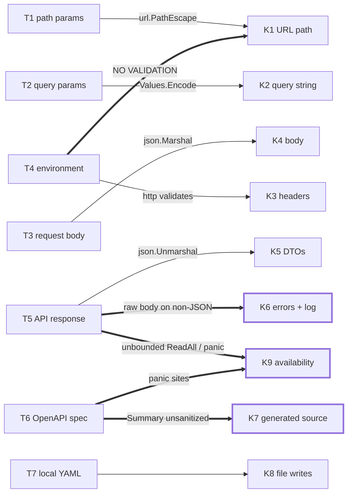

# Taint → sink reachability map

Which untrusted inputs reach which dangerous operations, what sanitizes each edge, and which edges are
actually reachable. Companion to [`ARCHITECTURE.md`](ARCHITECTURE.md).

Two trust domains, analysed separately, because they never run at the same time:

- **Runtime** — the client library an application imports. Taint arrives from the calling application, the
  process environment, and the API server's responses.
- **Generation time** — `generator/` (build tag `generator`), run by a maintainer or by the nightly
  `update.yml` workflow. Taint arrives from the upstream OpenAPI document and the repo-local YAML inputs.

## Sources and sinks

| ID  | Source                                                              | Trust                            |
| --- | ------------------------------------------------------------------- | -------------------------------- |
| T1  | Caller-supplied path parameters (`project`, `serviceName`, …)        | Untrusted if the app forwards end-user input |
| T2  | Caller-supplied query parameters (`query ...[2]string`)              | Same as T1                       |
| T3  | Caller-supplied request bodies (`in`)                                | Same as T1                       |
| T4  | Process environment (`AIVEN_TOKEN`, `AIVEN_WEB_URL`, `AIVEN_USER_AGENT`, retry knobs) | Deployment-controlled |
| T5  | API responses (status + body)                                        | Trusted only as far as T4's host is trusted |
| T6  | Upstream OpenAPI document (`openapi.json`)                           | First-party, fetched over HTTPS  |
| T7  | Repo-local generator inputs (`config.yaml`, `permissions.yaml`, `openapi_patch.yaml`) | Maintainer-controlled |

| ID  | Sink                                             | Class                                  |
| --- | ------------------------------------------------ | -------------------------------------- |
| K1  | Outbound URL path                                | SSRF, traversal, request splitting     |
| K2  | Outbound query string                            | Parameter smuggling                    |
| K3  | Outbound request headers                         | Header injection, credential disclosure|
| K4  | Outbound request body                            | Injection                              |
| K5  | Response deserialization                         | Unsafe deserialization                 |
| K6  | Error strings and debug log                      | Information disclosure                 |
| K7  | Generated Go source                              | Code injection                         |
| K8  | Generator filesystem writes                      | Arbitrary write                        |
| K9  | Process termination / unbounded allocation       | Availability                           |

## Reachability

| Edge     | Path through the code                                       | Sanitizer                                   | Reachable |
| -------- | ----------------------------------------------------------- | ------------------------------------------- | --------- |
| T1 → K1  | handler method → `fmt.Sprintf` → `d.Host+path`               | `url.PathEscape` on every string parameter   | **No** — verified exhaustively |
| T2 → K2  | `fmtQuery` → `url.Values.Encode()`                           | `Encode()` escapes key and value             | **No**    |
| T2 → K1  | query values never touch the path                            | structural                                   | **No**    |
| T3 → K4  | `json.Marshal(in)`                                           | encoder                                      | **No**    |
| T4 → K1/K3 | `AIVEN_WEB_URL` → `d.Host+path`; token → `Authorization`   | **none**                                     | **Yes** — F1 |
| T4 → K3  | `AIVEN_TOKEN` / `AIVEN_USER_AGENT` → header values           | `net/http` rejects CR/LF in header values    | **No**    |
| T5 → K5  | `json.Unmarshal` into generated DTOs                         | stdlib; no custom unmarshalers, no `unsafe`  | **No**    |
| T5 → K6  | non-JSON error body → `Error.Message` → app logs             | a comment asserting bodies are non-sensitive | **Yes** — F2 |
| T5 → K9  | three unbounded `io.ReadAll`                                 | **none** — no `MaxBytesReader`               | **Yes** — F3 |
| T5 → K9  | `body.Close()` error → `panic` in library code               | **none**                                     | **Yes** — F4 |
| T6 → K7  | `Path.Summary` → `jen.Comment` unsanitized                   | **none** — only sink bypassing `fmtComment`  | **Yes** — F5 |
| T6 → K9  | `lowerFirst("")` and 6 other generator `panic` sites         | **none**                                     | **Yes** — F6 |
| T7 → K8  | config package key → `filepath.Join` → file write            | **none**                                     | Yes, trusted input — F7 |
| T7 → K9  | malformed embedded `permissions.yaml` → `panic` in `init()`  | **none**                                     | Yes, build-time — F8 |



Thick edges are reachable without an intervening control.

## The clean result: the generated surface has one sink class

The 18k generated lines under `handler/` import exactly five packages — `context`, `encoding/json`, `fmt`,
`net/url`, `time`. No `os`, `os/exec`, `text/template`, `database/sql`, `unsafe`, or `reflect` anywhere in
generated code. The entire generated attack surface is URL construction, and it is uniformly sanitized:

- 391 path constructions across 43 packages
- 738 `%s` verbs, 738 matching `url.PathEscape` calls — zero mismatches
- 4 `%d` verbs, all bound to `versionId int`
- 3 enum-typed path parameters, all `url.PathEscape(string(v))`

`url.PathEscape` escapes `/`, `?`, `#`, `%`, space, CR and LF (verified empirically), so caller-supplied path
parameters cannot traverse segments, smuggle a query, or split the request. `../../admin` becomes
`..%2F..%2Fadmin` and stays inside its segment.

Because the generator emits this from a single code path (`main.go:315-345`), the property holds by
construction rather than by review — but it is also only ever one generator edit away from being lost, and
nothing tests for it. See "Suggested hardening".

Also verified sound, since it is the bug this design invites: the singleflight key is
`method|host|path|query` with **no token component**, but `singleflight.Group` is a field on `aivenClient`
(`client.go:118`) and the token is per-client, so two clients with different credentials can never share a
response. Cross-tenant leakage is not reachable.

## Findings

### F1 — `AIVEN_WEB_URL` is unvalidated and the bearer token follows it — Low/Medium

`client.go:191` builds every request as `d.Host + path` and `client.go:198` attaches
`Authorization: aivenv1 <token>`. `d.Host` comes from `envconfig` (`client.go:108`) with no scheme allowlist,
no TLS requirement, and no host check — only a trailing `/` trim. Anything that can set an environment
variable in the process (a CI job definition, a compromised container spec, a `.env` file) redirects every
request, with credentials, to a host of its choosing.

Environment control is often already a high-privilege position, which is why this is not rated higher, but it
is the highest-impact reachable runtime edge and it is a cheap fix: require `https` unless the host is
loopback, and reject a `Host` carrying a query or fragment.

### F2 — Raw response bodies land in error strings — Low

`error.go:69-76`: when a non-2xx body fails to unmarshal into `Error`, the code branches on validity —

```go
if json.Valid(b) {
    e.Message = err.Error()   // deliberate: avoids echoing a valid-JSON body
} else {
    e.Message = string(b)     // "If it is not valid json, it shouldn't contain sensitive data"
}
```

The valid-JSON branch is careful and correct: Go's `UnmarshalTypeError` names the type but not the value, so
nothing leaks. The other branch rests on an assumption stated in a comment. A gateway, WAF, or proxy sitting
in front of the API — or any host reached via F1 — returns non-JSON bodies routinely, and whatever they
contain is concatenated into an error that applications log. Truncating to a few hundred bytes would keep the
diagnostic value and bound the exposure.

Related, lower: with `AIVEN_DEBUG` the logger writes `path` and `query` to stderr (`client.go:144-152`).
Those carry project and service names and any caller-supplied query values. The token is never logged —
confirmed, `Token` appears only at `client.go:72`, `110`, and `198`.

### F3 — Unbounded response reads — Low

Three sites read a response body with no cap: `client.go:205` (every response), `error.go:84`
(`fromResponse`), and `retry.go:53` (every 404, buffered again on each retry attempt to run the
retryable-body regexes). A hostile endpoint — reachable via F1, or a MITM if F1 is used to downgrade to
plain HTTP — streams an oversized body and exhausts memory. `http.MaxBytesReader`, or an
`io.LimitedReader` sized to something well above the largest legitimate Aiven response, closes this.

### F4 — The library panics on a body-close error — Low

`retry.go:45-50`:

```go
defer func(body io.ReadCloser) {
    err := body.Close()
    if err != nil {
        panic(err)
    }
}(body)
```

A `Close()` error on a 404 response — a mid-response connection reset is enough — takes down the importing
application. A library should never panic on a transport error; this should be swallowed or surfaced through
the returned error. This is the only `panic` on a runtime path that is driven by network conditions.

### F5 — `Path.Summary` is the one generated comment that is not sanitized — Low

Every comment sink in the generator routes text through `fmtComment`, which strips `\r\n` (and rewrites
`[DEPRECATED]`): `main.go:523` (struct docs), `main.go:578` (field docs), `main.go:679` (query-param helper
docs). One does not — `models.go:104`:

```go
s := fmt.Sprintf("%s %s", p.FuncName, lowerFirst(summary))   // summary straight from the spec
c := jen.Comment(s)
```

`jennifer` renders a comment containing a newline as a `/* … */` block rather than `//` lines. A summary
containing a newline *and* `*/` therefore terminates the block early and emits its remainder as Go tokens
inside the handler's `Handler` interface. Confirmed against `jennifer v1.7.1`: the input

```
FooGet gets a foo\n*/\nfunc Injected() { panic("pwned") }\n/*
```

produces source where `func Injected()` sits outside the comment.

Impact is bounded by `File.Save` running `format.Source`, which rejects anything unparseable — so the
realistic outcome for malformed input is a **failed nightly `update.yml` run**, not a silent backdoor.
Injection that is syntactically valid *in interface-body position* would be written to disk, though it then
has to survive compilation against the handler struct. And the spec is first-party over HTTPS, so this is
defense-in-depth, not a live vulnerability.

It is still the only unsanitized sink of remote data into generated code, and the fix is to wrap the summary
the way every sibling call site already does:

```go
s := fmt.Sprintf("%s %s", p.FuncName, lowerFirst(fmtComment(summary)))
```

### F6 — Spec shape changes crash the generator — Low

`lowerFirst` (`models.go:562`) does `s[:1]` with no length guard. An operation whose `summary` is absent or
empty panics the generator with `slice bounds out of range [:1] with length 0` — verified. Since `summary`
is not required by OpenAPI, upstream dropping one breaks the update pipeline.

Six further `panic` sites are reachable from spec content rather than programmer error:
`main.go:319` (path parameter of an unsupported type — note that a path parameter named `*_at` or `*_time`
is remapped to `time.Time` by `models.go:290-297` and then has no entry in `strFormatters`, so this is
reachable through ordinary naming), `models.go:207` (unresolvable `$ref`), `models.go:321` (malformed
`additionalProperties`), `models.go:500` and `models.go:543` (unknown schema type — and `543` dereferences
`s.parent.name` while building its own panic message, so a root-level unknown type nil-panics instead).

None of these are security issues in themselves; together they mean a hostile or merely sloppy spec revision
halts releases rather than degrading gracefully.

One variant of the same fragility fails *quietly* instead, which is worse. At `main.go:336-341` an enum path
parameter is stringified with `jen.String().Call(v)` before the `SchemaTypeString` check applies
`PathEscape`. For the three string-typed enum path parameters that exist today both steps apply and the
result is correct. An **integer**-typed enum in a path would instead emit `string(v)` — a Go rune conversion,
not a decimal rendering — get no `PathEscape`, and be formatted with `%d`, producing a malformed URL that
compiles cleanly and only misbehaves at runtime. Worth pinning down before an integer enum ever appears in a
path.

### F7 — Config keys become filesystem paths — Informational

`main.go:431-439`: `fileName := strings.ToLower(pkg)` where `pkg` is a top-level key from `config.yaml`, then
`filepath.Join(cfg.HandlerDir, fileName)` and `MkdirAll` + `Save`. A key containing `../` writes outside
`handler/`. The input is a maintainer-edited file in the repo, so this is a note about a missing invariant
rather than a vulnerability — an identifier-shaped validation on package keys would make it structural.

Adjacent: `readConfig` and `readPermissions` **rewrite their own input files** (`main.go:644`,
`permissions.go:58`), so running the generator mutates the working tree beyond the output directory.

### F8 — Malformed embedded permissions crash importers at init — Informational

`permissions.go:14-19` unmarshals the embedded `permissions.yaml` in `init()` and panics on failure. The file
is committed and generator-normalized, so this only fires on a corrupted commit — but the blast radius is
every program importing the package, failing before `main` runs.

## Suggested hardening

Ordered by value per unit of effort:

| # | Change | Addresses |
| - | ------ | --------- |
| 1 | Wrap `summary` in `fmtComment` at `models.go:104` | F5 |
| 2 | Length-guard `lowerFirst` | F6 |
| 3 | Return an error instead of `panic` on `body.Close()` in `retry.go` | F4 |
| 4 | Validate `Host` in `NewClient`: parse it, require `https` off-loopback, reject query/fragment | F1 |
| 5 | Cap response reads with `http.MaxBytesReader` | F3 |
| 6 | Truncate `e.Message = string(b)` to a bounded prefix | F2 |
| 7 | Add a generator golden test asserting every `%s` in a generated path has a matching `PathEscape` | keeps the T1 → K1 property from regressing |
| 8 | Validate `config.yaml` keys against `^[A-Za-z][A-Za-z0-9]*$` | F7 |

Item 7 is the one worth doing even though nothing is broken today: the sanitization of the primary sink is
currently an emergent property of one `if` in the generator (`main.go:340`), with no test that would fail if
someone reordered it.
